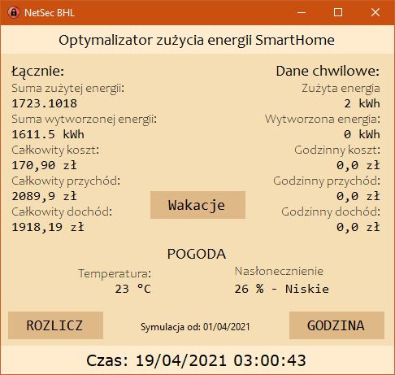
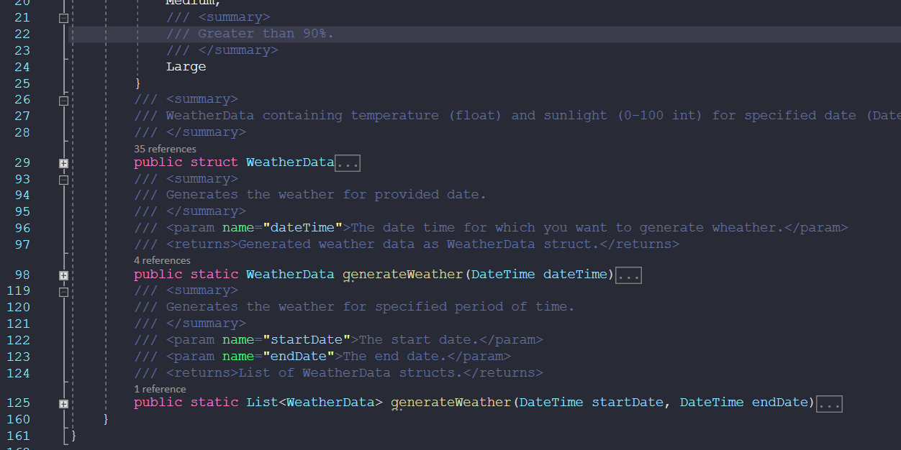
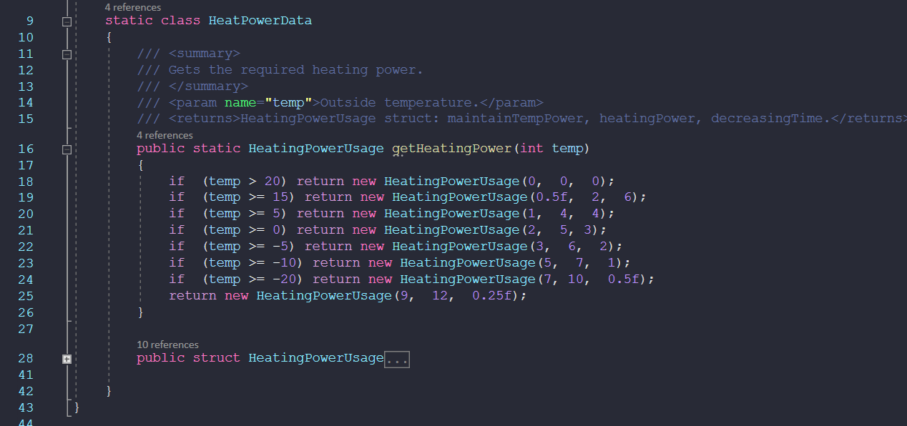

# NetSecBHL Weather App - 
### *Aplikacja została w całości napisana w ciągu 24h podczas hackatonu BEST Hacking League.*
> *Autorzy: [KifoPL](https://github.com/KifoPL) i [Stefaneco](https://github.com/Stefaneco)*

> Przyszła data wynika z symulacji pogody w przyśpieszonym tempie.

> * Pełna dokumentacja dostępna jest w [pliku](params/Dokumentacja z przebiegu prac.pdf)

## Treść zadania konkursowego
Celem jest optymalizacja poboru energii elektrycznej z sieci przez nowoczesny dom (lub 
bardziej ogólnie budynek). Jako parametr optymalizowany przyjmiemy koszt, zmienny w ciągu 
doby i w poszczególnych miesiącach roku - cel osiągniemy przez minimalizację kosztu energii 
elektrycznej w ciągu roku.

Przyjmujemy tu, że koszt energii jest podstawowym czynnikiem, na który zwraca właściciel 
domu, a jednocześnie ze względu na charakterystykę produkcji energii elektrycznej (źródła 
konwencjonalne mają dużą bezwładność, źródła odnawialne dostarczają energię okresowo) 
zwiększenie poboru w godzinach/dniach, gdy dostępna jest tańsza energia pomaga też na 
ogólne zmniejszenie emisji CO2.

> Parametry zadania dostępne są w [pliku](params/ZADANIE_SW_-_PARAMETRY.pdf).

## Opis elementów systemu:
 1. Dom wyposażony jest w ogrzewanie ELEKTRYCZNE (podłogowe), sterowane oddzielnie 
dla każdego pomieszczenia. W każdym pomieszczeniu znajduje się termometr 
mierzący temperaturę powietrza.
 2. Woda użytkowa również ogrzewana jest elektrycznie.
 3. Ogrzewanie podłogowe oraz podgrzewanie wody użytkowej obsługiwane jest przez 
automatykę limitującą maksymalną moc chwilową zużywaną przez te dwa elementy 
systemu do wartości podanej na liście parametrów. Jeśli wymagana moc grzewcza 
przekracza podaną wartość, to priorytetem jest nagrzanie wody użytkowej w 
zbiorniku do zadanej temperatury, w drugiej kolejności ogrzewane są pomieszczenia. 
Automatyka realizuje algorytm rozdziału mocy – jego opracowanie może być tematem 
oddzielnego zadania, ale na potrzeby tego zadania zakładamy, że ogranicza max 
chwilową kosztem wydłużenia czasu pracy.
 4. Dom wyposażony jest w rekuperację (wentylację mechaniczną z odzyskiem ciepła), 
która powoduje wyrównanie temperatury średniej pomiędzy pomieszczeniami w 
domu, dlatego obecnie przyjmujemy jedną temperaturę docelową dla wszystkich 
ogrzewanych pomieszczeń, zgodnie z tabelą w parametrach. Podano też czas spadku 
temperatury wewnątrz po wyłączeniu ogrzewania.
 5. Dom wyposażony jest w instalację fotowoltaiczną o wydajności podanej w 
parametrach.
6. Jako prosument możemy w ciągu roku rozliczyć pewną liczbę kWh (wartość podana w 
parametrach) na a zasadzie “teraz oddaję, kiedy indziej pobiorę” - w stosunku 1:1 za 
energię oddaną do pobranej. Wybieramy, z których dni liczymy energię oddaną, a z 
których pobraną (do maksymalnego poziomu podanego limitu), ale bez możliwości 
wskazania konkretnych godzin. Wybór dni możemy podać na koniec roku.
7. Dom wyposażony jest w akumulator domowy o pojemności podanej w parametrach. 
Stopień naładowania akumulatora można odczytać.
8. Dom wyposażony jest w zestaw sterowalnych przełączników pozwalających wybrać 
jeden z trybów pracy:
    1. energia produkowana przez zestaw fotowoltaiczny zużywana jest na potrzeby 
domu, braki w mocy chwilowej automatycznie uzupełniane są z sieci, nadmiar 
wykorzystywany jest do doładowania akumulatora,
    1. energia produkowana przez zestaw fotowoltaiczny zużywana jest na potrzeby 
domu, nadmiar oddawany jest do sieci, niedobór pobierany jest z sieci; akumulator 
nie jest ładowany, ani rozładowywany,
    1. energia produkowana przez zestaw fotowoltaiczny zużywana na potrzeby domu, 
niedobór pobierany jest z sieci, nadmiar nie jest wykorzystywany; akumulator 
ładowany jest z sieci w maksymalnym możliwym tempie,
    1. energia produkowana przez zestaw fotowoltaiczny oraz energia zgromadzona w 
akumulatorze zużywane są na potrzeby domu, niedobór pobierany jest z sieci.
9. Możliwe jest pobranie danych o prognozie pogody (temperatura, siła wiatru, poziom 
zachmurzenia) przez API z ICM meteo.
10. Dom ma zainstalowane podstawowe czujniki pogody na zewnątrz: termometr, czujnik 
nasłonecznienia. Standardowo podłączone są do sterownika ogrzewania, ale można 
pobrać wartości aktualne.
11. Dom ma zainstalowane czujniki temperatury wewnątrz. Dodatkowo można też 
odczytać temperatury powietrza nawiewanego i pobieranego z domu przez 
rekuperację. 
12. Temperatura wewnątrz domu nie może być niższa niż temperatura na zewnątrz (brak 
klimatyzacji).

## Technologia:

Przyjmujemy, że wszystkie systemy sterowalne w domu mają interfejs pozwalający podłączyć 
je do urządzenia, na którym działać będzie aplikacja/system sterowania zużyciem energii. 
Urządzeniem może być komputer działający pod kontrolą jednego z typowo używanych 
systemów operacyjnych (Windows, Linuks). Dopuszczalne jest przygotowanie rozwiązania 
bazującego na tablecie/telefonie (systemy op. Android, iOS) lub systemach 
uruchomieniowych typu Raspberry Pi lub Arduino (system operacyjny do potwierdzenia, 
dopuszczalny jest np. FreeRTOS). Urządzenie ma dostęp do Internetu i może go używać w celu 
pobrania danych, może też wykonywać obliczenia “w chmurze”.
Rozwiązanie powinno być przygotowane z wykorzystaniem ogólnie dostępnych dla danej 
platformy środowisk/ języków programowania/ komponentów aplikacyjnych. 
Oprogramowanie to powinno być dostępne do użycia bez opłat przynajmniej do użytku 
prywatnego (rodzaje licencji do potwierdzenia).
Zakładamy, że istnieje biblioteka funkcji służących do komunikacji ze sterowalnymi 
pozwalająca na „przykrycie” obsługi poszczególnych komponentów.

## Solucja:

Ze względu na ograniczony czas, musieliśmy posłużyć się sprytnie ulokowanymi instrukcjami warunkowymi, symulującymi działanie hardware’u. Ponadto, z powodu braku łatwo dostępnych, darmowych źródeł danych meteorologicznych, zdecydowaliśmy się na wygenerowanie rekordów, zawierających temperaturę i nasłonecznienie, które w naturalny sposób dostosowują swoje wartości do pory dnia i roku.

> * Generacja pojedynczego rekordu dostosowuje losowość danych do pory dnia oraz roku.
> * Generacja listy rekordów zabrania generacji nienaturalnych amplitud temperatur oraz nasłonecznienia w ciągu niewielkiego przedziału czasowego.

Parametry zadania zawarliśmy w statycznych klasach, służących za struktury danych, gdzie każdy obiekt przechowuje oddzielną tabelę wylistowaną w zadaniu. Po przeanalizowaniu rekordów skrajnych, zaobserwowaliśmy, że dla zewnętrznej temperatury 21 st. oraz wewnętrznej 21 st, przy oczekiwanej temperaturze 23 st., nie jesteśmy w stanie podnieść temperatury - po konsultacji z mentorem, założyliśmy brak konieczności grzania pomieszczenia.

W aplikacji tworzymy podsumowanie zużycia energii godzinowo, w przeciągu dnia i rocznie.
Z podsumowania dnia obliczamy średni koszt za pobrany kW mocy. Taką samą operację wykonujemy dla mocy oddanej, obliczając średni przychód za kWh.
Dzięki uzyskanym danym możemy wybierać kolejno dni o najniższych średnich przychodach i zadeklarować je jako dni oddawania mocy do banku energii.
Następnie wybieramy kolejne dni z największym kosztem za pobrany kW aż do momentu osiągnięcia ustalonego limitu.

Aplikacja jest w pełni konfigurowalna, kod jest przystosowany do dalszego rozszerzania kontrolek nad zmiennymi. Podczas nielicznych, manualnych testów, jakie zdążyliśmy wykonać, aplikacja nie wywoływała większych problemów.

> Konfiguracja ustawień wstępnych akumulatora to tylko szybka prezentacja modyfikowalności kodu, w przyszłości możnaby sterować dowolnym parametrem za pomocą kontrolek.

Kod źródłowy został napisany z uwzględnieniem zasad czystego (SOLID-nego) kodu. Każda ważniejsza metoda jest w dokładny sposób opisana za pomocą komentarzy XML. Modularna budowa kodu i funkcji umożliwia proste nadpisanie metod połączeniami z online’owymi bazami danych. Nasza staranność i solidne przygotowanie teoretyczne pozwoliło zbudować fundamenty pod aplikację, która w możliwie optymalny i modularny sposób, spełnia swoje zadanie.

Statyczne klasy, zawierające dane zawarte w treści zadania posiadają funkcje dostępowe, które po prostym nadpisaniu mogą służyć za komunikację z zewnętrznymi źródłami danych - dzięki temu nasze rozwiązanie, choć jest symulacyjne i zakodowane “twardo” w kodzie źródłowym, może w łatwy sposób zostać zastąpione metodami dostępowymi do zewnętrznych danych.

Stworzenie enumeratorów danych (takich, jak Workflow, DayType) pozwala na szybką i całkowicie bezpieczną edycję parametrów wejściowych. Można to zobrazować na przykładzie kontrolek odpowiadających za parametry wejściowe akumulatora, które udało nam się podczas maratonu zaimplementować. Cały back-end napisany jest z myślą o przyszłej modyfikacji parametrów.

